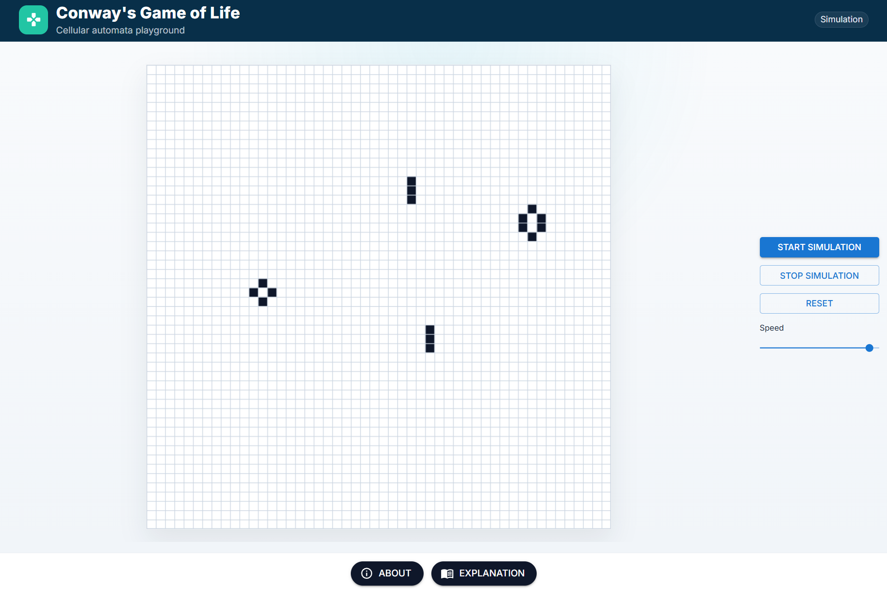

## Game of Life

This project is a simple implementation of Conway's Game of Life built with React and TypeScript.



The app lets you:
- create an initial pattern on the field
- start and stop the simulation
- reset the field
- change the simulation speed

## Tech stack
- TypeScript
- React
- Canvas
- React Router
- Vite

## Run project

Install dependencies:

```bash
npm install
```

Start the development server:

```bash
npm run dev
```

## Other commands

Build the project:

```bash
npm run build
```

Run linter:

```bash
npm run lint
```


